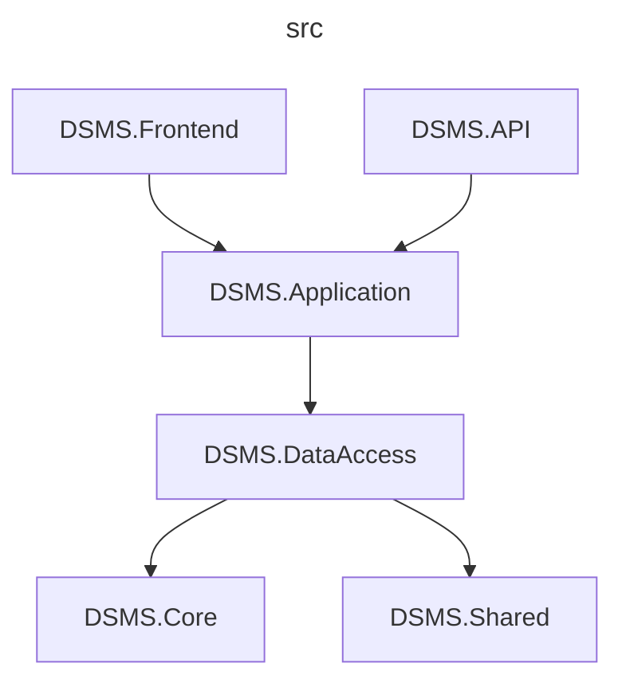

# Driving School Management System

## Table of Contents

* [General Info](#general-info)
* [Features](#features)
* [Technologies](#technologies)
* [Database Model](#database-model)
* [Project Dependency Diagram](#project-dependency-diagram)
* [Getting Started](#getting-started)
* [Credits](#credits)

## General Info

Driving School Management System is a web application that is used by driving school students, driving instructors and administration. It handles driving lessons scheduling and attendance tracking. 🚗📝  

> Project created as a college seminar:  
> *SRC136 - C# Programming*  
> *University of Split - University Department of Professional Studies*

## Features

### User Management

- Roles (base for authorization) ([ASP.NET Core Identity with Role services](https://learn.microsoft.com/en-us/aspnet/core/security/authorization/roles?view=aspnetcore-6.0)):
    - Student - Atendee
    - Instructor
    - Admin
- Available operations:
    - Features from [ASP.NET Core Identity](https://learn.microsoft.com/en-us/aspnet/core/security/authentication/identity?view=aspnetcore-6.0&tabs=visual-studio) (adapted to fit our needs)
        - **Registration**
        - **Authentication (login/logout)**
        - Edit and update user data
        - Delete user
        - View all users (with search, filtering)
        - View user details for specific user
        - Display & manage current user details
     
> **Note**
> By default, every new registered user is assigned `Student` role. Then, if needed, admin can change that user's role.

### Driving School Management

> **Note**
> Available categories are: `A`, `B`.

#### Vehicles

- Available operations:
    - Add new vehicle
    - Edit and update vehicle
    - Delete vehicle
- View all vehicles (with search, filtering and pagination)

#### Enrollment

- Available operations:
    - Add new enrollment
    - Edit and update enrollment
    - Delete enrollment
- View all enrollments (with search, filtering and pagination)

#### Appointments

- Available operations:
    - Make new appointment
    - Edit and update appointment
    - Cancel appointment
- View all appointments (with search, filtering and pagination)

> **Note**
> By default, it is only available to book/reserve appointments for future 5 working days. Appointments last 1 hour, and initially there are 8 time slots each day (10:00, 11:00, 12:00, 13:00, 14:00, 15:00, 16:00, 17:00). Appointments can have statuses: `Reserved`, `Completed`, `Canceled`.

#### Feedback & Reactions

> **Note**
> It is possible to leave reviews & ratings on driving instructor's profile (Users/Details page). Other users can mark specific reviews useful or not.

- Available operations:
    - Add new feedback
    - Edit and update feedback
    - Delete feedback
    - Leave reaction (useful or not) on specific feedback
- View all reviews (with associated reactions) for specific instructor

## Technologies

  
  
  
  
  

## Database Model

")

## Project Dependency Diagram

## Getting Started

### Requirements

You should have the following installed:

- [Docker Desktop](https://www.docker.com/)
- [Visual Studio](https://visualstudio.microsoft.com/)

### Running the Application

1. Open solution `DSMS.sln` inside Visual Studio.

2. Docker Desktop should be running:

3. Check that `docker-compose` project is set up as startup project:

4. Launch web app using **Docker Compose** setting, it should automatically open inside your web browser. Enjoy!

#### Managing the Database

[pgAdmin](https://www.pgadmin.org/) is available at http://localhost:15432/browser/.

## Credits

 ✍️ **no-ap-team** members: 

* [Nikola Bošnjak](https://github.com/LunarStrain94)
* [Nikola Occidentale](https://github.com/nikolaoccid)
* [Anamarija Papić](https://github.com/anamarijapapic)
