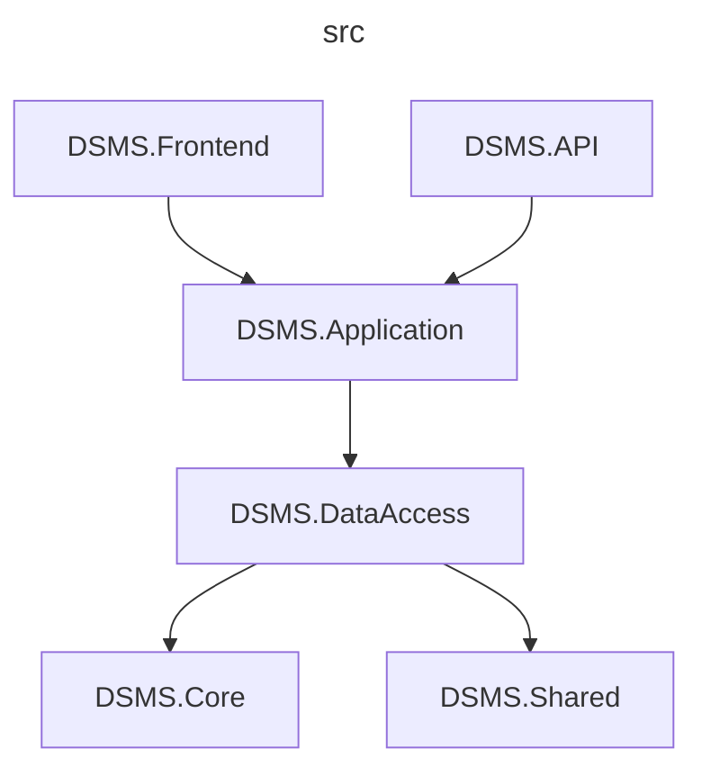

# Driving School Management System

## Table of Contents

* [General Info](#general-info)
* [Features](#features)
* [Technologies](#technologies)
* [Database Model](#database-model)
* [Project Dependency Diagram](#project-dependency-diagram)
* [Credits](#credits)

## General Info

Driving School Management System is a web application that is used by driving school students, driving instructors and administration. It handles driving lessons scheduling and attendance tracking. 🚗📝  

> Project created as a college seminar:  
> *SRC136 - C# Programming*  
> *University of Split - University Department of Professional Studies*

## Features

### User Management

- Roles:
    - Student - Atendee
    - Instructor
    - Admin
- Registration
- Authentication (login/logout)

### Driving School Processes Management

- Anonymous user registers on the site, and enrolls in the driving school by selecting a category:
    - A
    - B

#### Driving Lessons Course - "Upravljanje vozilom (UV)"

- Student chooses his driving instructor
    - Student can change his instructor later if he is not satisfied
- Instructor enters his working hours for upcoming period
- Students pick available driving lesson appointments (1 h) with their instructors
    - Student and instructor can cancel reserved appointment
- Instructor tracks completed driving appointments (x35 mandatory)  

##### Instructor Feedback

- On driving instructor's profile his students can leave ratings and reviews (anonymous or not)
    - Other students can mark specific reviews useful or not

### Bonus Features - If Time Allows

- Mail sending
    - 'Welcome' email sent to student when he registers and enrolls in driving school

- Payment processing integration with [Stripe](https://stripe.com/)
    - Additional driving lessons (no. 35+) are to be charged
    - Late canceled/no show driving lesson appointments (student-side) are to be charged

## Technologies

  

  
  
  
  

## Database Model

[](https://viewer.diagrams.net/?tags=%7B%7D&highlight=0000ff&edit=_blank&layers=1&nav=1&title=Driving-School-Management-System.drawio#R7V1tc6M2u%2F41mdmeGXfMq%2B2PtuPd%2Bmk2ybG97fZ8Yw2JeUpMCniT9NcfgREGSWBhQGCkzs7UVrAA6dJ93W%2B6daPMX96%2FeMbr7qtrWs6NPDTfb5TbG1mWJH0E%2Fhe2fBxbRvrw2PDs2WZ80alhbf9rxY3wsoNtWn7mwsB1ncB%2BzTZu3f3e2gaZNsPz3LfsZU%2Buk73rq%2FFsYQ3rreHgrX%2FaZrA7to7l0an9N8t%2B3gXJC0%2BOf3kx4MXxm%2Fg7w3TfUk3K4kaZe64bHD%2B9vM8tJxw8OC7H333O%2BWvyYJ61D2h%2B8H%2FBb7OPzfTbt1f72%2BN%2FZoflw%2FjPgTJUjv38NJxD%2FMrx4wYfcAwsEwxJ%2FNX1gp377O4NZ3FqnXnuYW9a4Y2G4NvpmjvXfQWNEmj8rxUEH%2FH8GofABU274MWJ%2F2oa%2Fi76ffgFf7P4ZX334G2tgteBCDG8ZysouA7M0%2FHK8NVSt4hH7ovlvliB9wEu8CzHCOyfWTQYMaiek%2BtO4w4%2BxENfYhokbBK%2B%2BZbnYzMBMPQafgyMH9G4%2B%2BBNg3hQlXDowTIIDHtvefFQbl3HMV59O7r82LKzHfPO%2BHAPAewIfps92e%2BWuTquGSma1rc70Jkfz%2BsT6BziIPyz4djPe%2FB5C%2BYpvOPMs3zwLHeGH8RXpGY4d1J%2FWl5gvRdOQvxXFS6lWJbIw%2Fj722llJsttl1qVijLMn7j4disgPYz9M3i55H6Klr2fgt9uRLobcjPDAaOzNwJrFq4SHwNL8qKX40c%2Bv4gz0FmFgmi2cz373xAwTjzBaThF39%2FsF8fYAwlnmEjTzI0kegQL23HmruOGmNu7ewuDXXiR6bmvG7gsw4ZX194H0QhpM%2FAPjNl8%2BKt2o4FnnYPv0uk7%2BBde7gVzd%2B8HHoB32IcFUPZmhUibBZGQCTt1rCfYvxdPSPj5hxsE7ksuEAuX5Hl05qODDMYCLFYSIrgkf%2Fw9Fwbg%2FQPbcE6oj2RHSKHGadIIM0sc62R80YFHJYYLhvPJiVhwZ5umBaTH7G1nB9b61YgE%2BxvQIs7JjcIVcH66UvOjlJwegqgo2RsDWaASuWRpgrZP68VqOb37pWVUQN44Xjvzwdzb%2B%2Be74y91BDZaR2DzfpO3yqVJrTCi6o4Fp0hjQSIkEhk2SCJ62yQC4IfJj89t04hl2rC%2FhlkEYl7wyCDBXQoJK9exjkyyvN8svixWnaeSbmCFO%2FLQhEHSOpdM2uYSnR4EPeMRjXqu%2Bs4iI1ybsD0%2FuDdewuf99Md0Nf9tyjON0EOFOxJRBGkwJw1Jbps1FIUXloD4FjQxUHCvVRhGEDRxAVb44wnhqGLPE1rrPDHhhieEUyoJbuA%2BqVtww4enme2BRwVUcTvdLHjmCeGUyvfY5UsMwRNN8cS4dZ4Y5s56z3gC4lvwxEDBM6oWL4btTE3Ts3xf2BQl8cIfV%2BiCK1hzRZL02170e8QNV%2BjUs9N3rpChypxKnDN8%2F831TMETJbHCH0%2Fke6sFTzTFE2rrPKFywxMK9ez0nifwpJZHzwVTaT3a2%2BDgiUhFWcTwxxb5vgjBFk2xxah1tpByZ71vbDGknp3eswUM2J7Y4sH%2BISiiJEy4owgp3wUhKKIhilCoN5I2RREFe216RhEQ34IiBoStNktzbnjm%2FeHlh%2BUJriiJF%2B64QsWjXOEOHVE3IAsIHU4XtAhICBkTpnTSlLhXceVQsH7FDfvqBbRPB4PGWF%2Flest%2BsgiEJqDi6c%2BnrZZi0%2F7lwClQCbR6VQKa7lggSey8rN2eLM8shG38jJmF372Xqth8mQwFvvsypBWxq%2BYCrHDHJBquk8zBDZ8BUwgLE0GFhFSKI2aySSUtTAJM4tuNs3cjsc2wIyAS6kjthm6yMCuVpiOhsTF1RMPVEY4MXU1oJMlQ4BpJTCofwtitCp4CFaWs8XFGRaHpjgWa8MxdwS4Vjd3y7EKqWceWXfA4Wsvyg12hIbE1OKk2NcRQAKlFGLwX4IU7NhnjAFqGgvewDVzP76ftS0IVDqXK9rBKqkXXmD1M2nMsqR0BGR6yFypLnspSXr4la%2Fh6bOOxjCEitI3nn39vO22YxkIuLUuKV0UpNUavlYZoemMhIPCcgBMLXVftXRojmTl%2B3rOz3X8%2F%2Fhj34wvGyXPBsmCc1u3lMWEj25Fx2rabGTIOvZuj94yDO%2BezPlnBNxXQwx3fTHAF5g9rZ29FXjKKiZEUrzxoihD2tRNTzRMDt5yZrKvZ%2B0mEnZEdyWyfCKWl9rjxhH5jdkGCdNmdFJU0lQlZU%2Bm8jlKPs3ZykY7SS%2Bf%2BBNdRYlIRYeOq2Clw9Ner71J1xwJMeBKCIJeKYePy5ELSiNmSC549wM9JZxOxDTcZCsI23Cv1uHYCL9zxiTQUxULZ8wchpMyWP6Qh4XArbggkAb1gEDAWuCpxnS7UbuCFQwbBc48EpTCnFNLhZ6w5pUR%2BUO8YhT6U2n9GkTEc3Fr%2B1rNfA9vdh5SyWXzfcM0n9GjhkE%2FwIJzgE%2FZ8QjgkjTWflAik9Y5PRO3q01jgkbQ4gPK4cwP3RuyOKIkYDjkF95OutzvLPDjW2nEDkd2RRcZ4FIMJ%2BqvGExwqpK0vCWuU3QSRvd9I1%2FD70RQ1ZYElmO8o9JP68jtOC%2FR6KuBJEm7vcpThcVoHQkWRJNzkDXlFJHhUhg53tYskSdi%2Ftdu%2FF%2FBL63XwJAm3fzmK0UnCAj6NBW4Bp9I8bm9ElK4kYjhklRJVNQWrNMYqpMwPxqxSIoO0d5wi8j5OY4HnfazDtb2xjwVnbqebxWb5dcE1o9SS99FXRilRukowSmOMQkz8YEspyZloPFIK%2FYT1nlJk3CG62JuCUC5CC3%2BEouBW7vQ1ktgv1l7E6NBd%2BciOaHKMTsOn9sIYnTbK3q%2FTMTpFWLv1x%2BgU%2BnK%2BRTE6AiSbU00U3NrlKUanCIP3NBa4wZuiFxGqq4ygIo2l5KI%2Fp7FQdMcEUsIErt8ELk8zxFAdU5pRcQuYo1CdImzgExJwG3gdHMyEYUScrgxc%2BKMUcbxuJyiFGKdjSyl4GhBHlCIO2E2NBZ4HdEouFHxSBisc8ok4xa4LfEKO0rElFNwnyhOhiIPsTmOBO0XXgREcfJFKWB4tHFIKMXMIwEdUSUZAocKNDpAFhirlRrqiw4Qq0oDwWdYfGlPpzybrzPY1GAbmNDSmCqflCQokp2WkEEQ2poiKVQAPf3k8mnBh1m9ylmeY9jewaSV2MvbN3kwWgaAXSSM4MCN6EYfbXoIX%2FhhFx%2FWTz5Zl%2FjC2fxczC3cW50jJWpw6KSuUVMZLHpWDCcxC1bP3U0lZocOuwEgoJvWbvjo9RrtyNI%2Bk44oJT6Zvsg6EbiLphCILMbUI47cyfPirNKeLeGv9xm95jmn9hB5J5zrcqotw62ks8HCrOKSnCmI4ZBU85CpYhT2rtH9uj45Hb3liFXoneO9ZBfprxEaDOuDCH6WMSpzWIiilMUrpwLk9oxJu0b4xyoh%2BwvrPKLhXdGMHjojQlYYKf2wCEwsEeTAlj%2FYP6RlL3HAFxLjgCjAWuM4AFksQjqA4360MUvijitFIUEULVDFunSpGY26oYkR%2F5HzvqWKEuyxXRgBksfBSlcUKh2ShCrJgTxay1D5ZaPyQhUo9P%2F0nCzxrYu5Z4J7mNLIsRBHhUnjpM2GsXjefv7%2F9M%2F%2F%2B%2B0%2Fzjz%2F%2FWh3uvowGsjAu2uALlSFfkOe9j7ZFIcL5YgvyUOCWxdKfgun7eHEPfkgXs4eHu8X0ng%2B2qAqXPpMFUdLJQxxAU%2FPF3mNw8cJnsCAVGN425gppeH6isC1AUap2%2FPsR%2BP7sGD7cP4TPaumok4QUndBlFZ9Q0pYctSllXiYcmXzKgGQ72DUM8BgWFe%2FQAOdWHb260VXHnYPvhGIfs7U3p54XSfCYIlLjlh1z690Ovqc%2B%2FxV%2B%2FlWLv92%2Bp%2F50C1VNMJ7ex%2Ff0l9Svwq%2Bnn0Xf4O9yJ8R3D97WKnhrWG0ogLpr3oXjeH4s89kqnGDPcozA%2FmllnqOAPR5DRTkl19QsMFS0Rs7xleJfneYc7wjZI6miyDm%2BMtYRmF%2FjI3VZrMjnP7CcvY8cD2nucyHXa3rmevDh%2BAT1cuAE3wCFh3SjXaspjSiFbZLIQPSdcPHbW8OZxs1QT6K1SJIFmFXNQFvpONsgfreKWBxICGTcpyffCpDpqmmC8B1F93VNUKykdmmGyk5QRdFOcVBMGdF%2BoZiGlCCVoITLRTvM2Tgr2hPFrWnZriCkrw4vlO0qIkNV1KyoSbajld202KRpWFbjO4lqEwW1yWq9Y7JayU4UO7mN79mpjVjrk9u1zRZjuU1RxfAClbyM%2FGWvksvwzN6zghuWxG5abmuTM%2BKWVm6PtMvkdl2rVRniLoruidZJa6K10mpVhrh7ooOisLbRZTy45UThNvQ22ls6LfYkzP7KyDKyZDMNfxd1UljM6LzWCd%2ForPRKuYRIpapgW1Uhh9ZUGqqXCTkdNfDRjmpSThWV%2FMC5jge98PpmlFmF4BS%2BctxSW0tXhttkrynsSGkGt%2BPxiPjADeOQYiNkVVWSTpGU2CmSQ0pMQ4uzcUUS9cmOL1QkJ6gDAPXU1YTVCRIEUiUGzlpFkjGsds1Zm6ynq9NSJTzM0zlHa42jW493RUKooDmHigJv1aCglq5WUCf1cxoPww0R7XI0vlStkIdnemra6Jfw0Er3xKl6reIUD610UJzWNro1iVOdmTiVy9lfVxf6IqbDUXtQkyqXTctTfaT8Okn9N86KxNGFwlVHPLMTlKiblq0yblZ1zaGaLIH2Y1XxLA1G7JZ%2Fg6ZEbeK5vgliy31yzRljdYeaKMTfmI3409B0P%2FVCgTdCnZ5oRzUZ%2FqMh%2BT65z4UquRMWTi0Zt5U6p9nK7WV1VVzdV5CRVePoMh7cbmVklUnSzRW3Z9XSEjEGiY1cVhGf%2F%2FjS4AHaka43I5dVxIM8jncH5T4Xcv3oTJAMvR6R%2B03J8e5nfCUrtn0tOulGyf6kSTX6CrK8apwhxlzQoSyvLvp8Ic6bJoOJVpOSLqF7L5rS0qUhSjtn1HTsB2Ot5A%2Bkoc6CERTcbdc9zf5aE9WUBp1W9Unz1hLVclYCO6eVgjutKhFC13zWOWe%2FytSEwGi%2Fho6IcUmWL2SE0eRcT007qpUGw%2F51CVSI%2B%2FZVbDhN7ML%2BMNms0xp2fRPEmPAojiurLFAlSnFau6%2BFLCSVCaU4ZeZsURBVcnSpNEXT6LCOGtr%2BNtaLlWX0ep2NqtxgBkJtkl3rimRHnScwJMluq7Oi4N6uDor62maMsainOEOsd1vmJJVW2EsqowQ6GXGmyJCPSqd4oEq4RJmXX996xf1znfNFQNhfnS9CxR093fNF1De6jAeXtOlDd8Ix2UmZIdb%2FObhhc1jqaOBHtY6m4AJFfX2Pxgn%2BHXx6jv%2FvwOsrdQQm6ae9fx6stzvXdQZfjb3xbL2A%2BRisP%2FzAeoE3AgNwvFf2%2FqA5fJNsY867VX8LeZz3FgYAheGHFeC%2BuqbllHtqBO0ASkEW5H7guX9bSHE%2BQr2%2BuOTezfFw7PjbJiriN5CHOauFVJUvS4Lp0m3%2BzjCjawsZq0QhLHSz4PFrau%2BYDlWz9OaxpIpQA4uGlNV0nDfT%2FkmEyQ%2FXMy1vsD3OxjT6sfdpMEi3%2F1KIQDBX%2B4a6tikXw6fF%2FvDySwqiNtrTDw9tOcCGuRFYz65nW370kEkfBwL0j%2B%2BKNUeDi3TvNDQmDnlQLu84%2Fc4ONnC1325WeLtw3J1z4oVWppzhWpRbX4AIiQqMksRK%2FfKCWMeTVDcP3WlXo7wgbdhJyQtsNdIuN%2FKaIC0T2LAOjODg06zBnMWGw%2FbYslqsF6s%2FFrdnUR5Lg4evj3eLDf310%2Fv54o768vuHwfq3hz%2B5XQOobSUNobV%2BrvysNNQaWwYkH%2Bt102aJhUrPac0NxqHmfleuU0GUXAlv335d3rPl7uX9erP6Nt88rNjed735dru433ArNcdjCtVBJQhNtALrJTLz4dv3v%2F5Z6Lup9Pnff5zHyXLwv4cByTrvu6uSuuCuNIzjGqzDUslxo1XDUlhHdRW%2BQZIJzlXcRa%2BHhU6o3%2BPM9To6gCWvV9V6i0oQ15qMrbUWfbhF0qDDHlziY3ernESzI8t0YBsqBFEm%2FaAb9EDcS8Jo4x5aNEzWEQOKOicYsdmUCdJRXSnBiPCGjg%2FqMvEyA2HcrYoUhauvQxkLTWQokN%2B9WzUtGp4ftkIdz%2F2oJNTJAvqMeGZbjIJW4WeXh4bIdOVSma4hVdgSS6JhhR%2Fet1kZjSfStJhWVriYrk1llhpMKKlNvtY2tjVtv2DGfmwqBnVKREPJ26GjMnSyWlpeRqMl1xs6Bgk7KkMu1rvRIzw09cz1aKKExoADulXdqHC1XhsHQKHSZQ7ofl0isjTDRnax91zHCbPKsCHOnJt8kz0jWQnHfBueoGzvw4MAo4HPnn0ctexsx7wzPtxDADuC32ZP9rtlrtw3P%2BGGtzvQGcymik4WjB%2BGePRghADQXXgQcnRF4dmopWMimFcCTm0qJiIT869Q3zZBpKfPRc27H236Rhvn7p5XA8Sh27lQLFyZ1EduE%2BBBhGNjJ27j3u3H33NhwOaYZVRmNHiqMvV09f0MbtwVf6KUpQn%2B8mm9WC2nd50%2FgjsNHq0j4Hm%2FyVvr0rhWMFF1xwBNFLtRBbPc5Bm19TCL3jaz4D72z20zi2XasL9miUWjnq2%2BEwseDohPND%2ByyvJ%2Bs%2FiyWHWeVroAFe5ohGKnq6CRhmlk0jaN4KEEfmhkTD1bfacRwilz8Y6sD0EkZcHCHZHQnA0nmKRhJpFoXa%2BNUQnh2DV%2BuESin7Dekwnu9FyGK%2BewDVxP0ElpvPDHJ7i7dGUZ28AGAriYWG54C8CpSGpXUsrs3LQWBuCq0YBwT9Yf%2BFKpgZEf%2BSotLarBAHdQchT6koSLMhkK3EcJpbkIfVUFT4FuQDozvYJuQNMdCzQJr2X9tmZpdiFEvxizC89%2BS0k4LpMsAdxx%2BdmyzB%2FG9m9haZZGC3dsQkhQFmzCnE0IQTC2bAJnnUs2KeF06D2b4J5LkU5xKVj4IxOKgguCTJomE1IcjDGblHCA9o1L6Ker91yC%2Bz%2BX%2FjffeoqK232aPTzcLab3PFMJPVa4oxLCCXtYXUnYQFt8fJJTe%2Fx%2FwN%2Bm68df7xcb8GnueuGYLEOlxw4%2BUoX9cgqR2%2BfK%2FV1Qh%2FzMHs%2Bk0h8JiNnd0zgWy4fYkJ22CZmkEy1kAm7qKDFORgdurgh0tIQOHS2mJ1GqHxegA3z13HB2TqIGvNXueGKAsvh%2F) 

## Project Dependency Diagram

## Credits

 ✍️ **no-ap-team** members: 

* [Nikola Bošnjak](https://github.com/LunarStrain94)
* [Nikola Occidentale](https://github.com/nikolaoccid)
* [Anamarija Papić](https://github.com/anamarijapapic)
